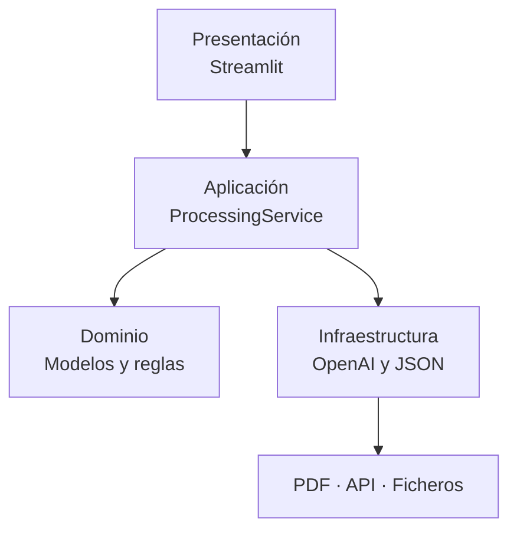
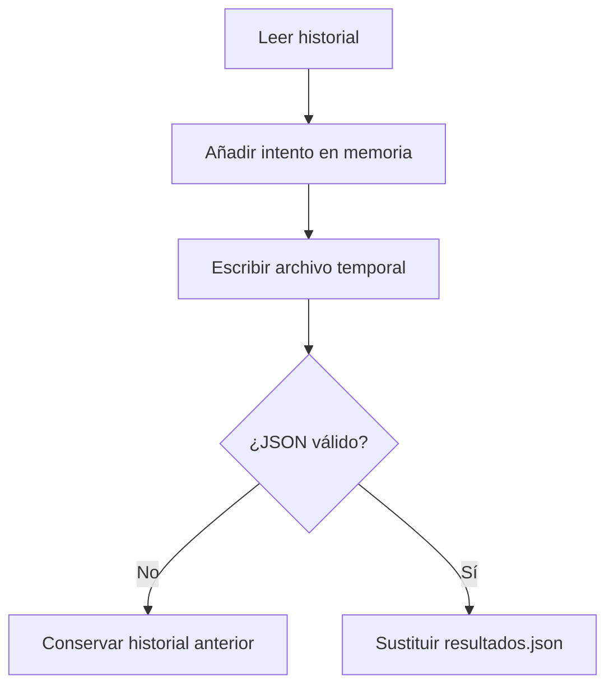
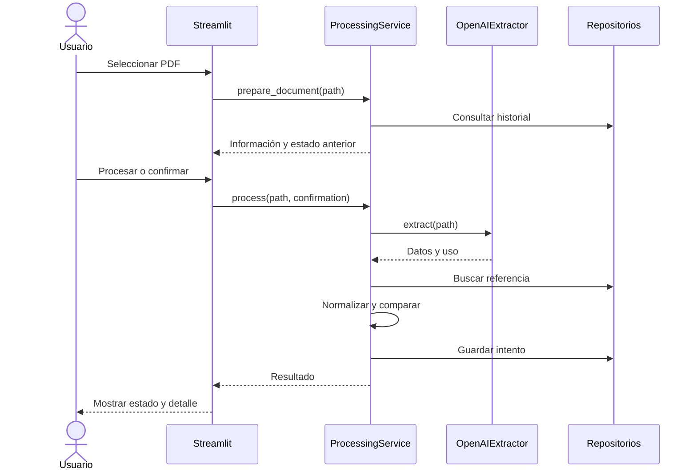
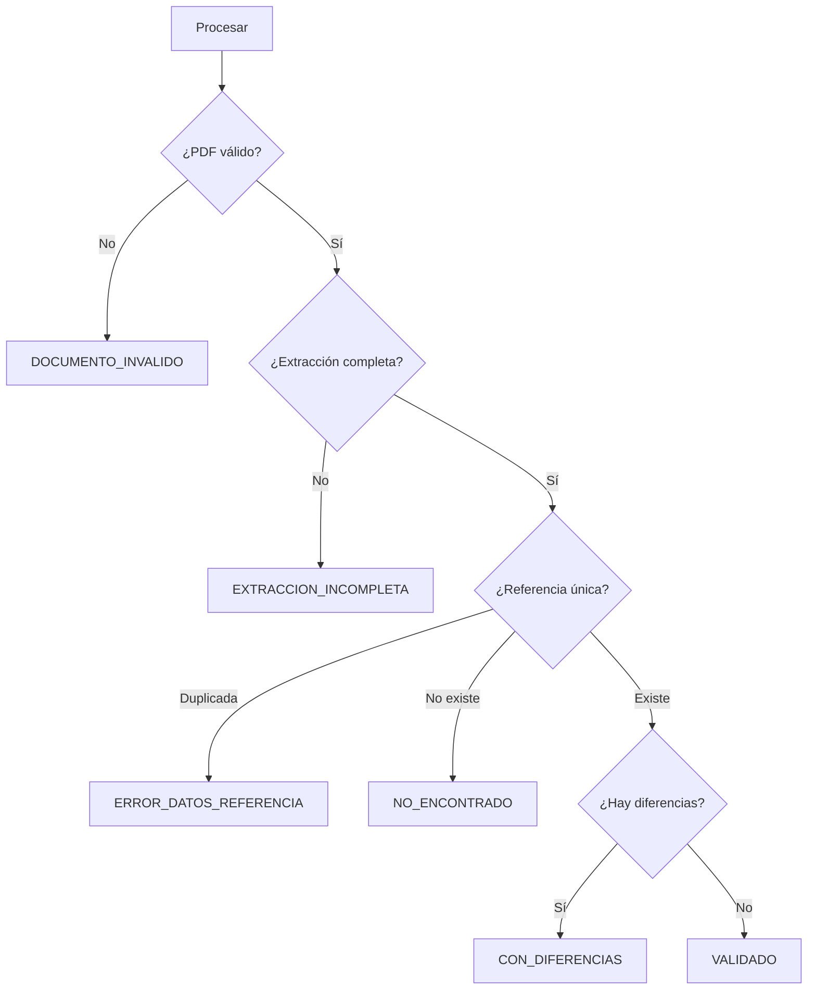

# Arquitectura de software — Comprobador inteligente de albaranes

| Propiedad | Valor |
|---|---|
| Documento | Diseño y arquitectura de software |
| Proyecto | Comprobador inteligente de albaranes |
| Versión | 1.0 |
| Estado | Aprobado para implementación del MVP |
| Fecha | 2026-08-06 |
| Requisitos de referencia | `requisitos.md` versión 1.2 |

## 1. Propósito

Este documento describe cómo se construirá el MVP del comprobador inteligente de albaranes. Traduce los requisitos funcionales, no funcionales y reglas de negocio en componentes, responsabilidades, dependencias, flujos y decisiones técnicas.

La solución permitirá seleccionar un albarán PDF almacenado en el proyecto, extraer sus datos mediante la API de OpenAI, normalizarlos, compararlos con `albaranes.json` y conservar cada intento en un historial local.

## 2. Objetivos arquitectónicos

- Separar la interfaz de las reglas de negocio y de la API de OpenAI.
- Mantener una única responsabilidad principal por módulo.
- Poder probar validación, normalización, comparación e historial sin consumir API.
- Evitar modificaciones accidentales en `albaranes.json`.
- Conservar el historial aunque se cierre o reinicie la aplicación.
- Proteger el historial frente a escrituras incompletas.
- Permitir cambiar modelo, timeout y otros parámetros sin modificar el código.
- Mantener el alcance adecuado para un proyecto académico de 14 días.

## 3. Restricciones y decisiones aprobadas

| Tema | Decisión |
|---|---|
| Lenguaje y versión | Python 3.12.x|
| Interfaz | Streamlit |
| Ejecución | Local en Windows y macOS |
| Navegación | Menú lateral |
| Entrada | PDF copiados manualmente a `data/pdf/` |
| Procesamiento | Un PDF por operación |
| API | Responses API de OpenAI |
| Modelo inicial | `gpt-5.6-terra` |
| Razonamiento | `low` |
| Detalle PDF | `low` inicialmente |
| Timeout | 90 segundos |
| Reintentos automáticos | Desactivados |
| Salida de IA | Structured Outputs validado con Pydantic |
| Referencia | `data/albaranes.json`, solo lectura |
| Historial | `runtime/resultados.json`, local y excluido de Git |
| Límite del PDF | De una a tres páginas |

El modelo es configurable. `gpt-5.6-terra` constituye el valor inicial acordado, pero podrá sustituirse mediante configuración si el proyecto de OpenAI no tiene acceso o las pruebas recomiendan otro modelo compatible.

## 4. Vista general



### 4.1 Capas

| Capa | Responsabilidad |
|---|---|
| Presentación | Navegación, acciones y visualización |
| Aplicación | Coordinación del caso de uso |
| Dominio | Validación, normalización, comparación y estados |
| Infraestructura | Acceso a OpenAI y persistencia JSON |

### 4.2 Regla de dependencias

Las dependencias avanzarán desde el exterior hacia la lógica de aplicación:

```text
app.py → ProcessingService → componentes especializados → API y ficheros
```

Se aplicarán estas restricciones:

- `app.py` no comparará datos ni abrirá archivos JSON.
- `comparator.py` no conocerá Streamlit ni el SDK de OpenAI.
- `openai_extractor.py` será el único módulo que conocerá el SDK de OpenAI.
- Los repositorios no decidirán estados de negocio.
- `ProcessingService` coordinará los componentes sin implementar sus detalles internos.

## 5. Estructura final del proyecto

```text
comprobador-albaranes/
├── app.py
├── README.md
├── requirements.txt
├── pytest.ini
├── .env.example
├── .gitignore
├── LICENSE
│
├── src/
│   ├── __init__.py
│   ├── config.py
│   ├── models.py
│   ├── exceptions.py
│   ├── pdf_validator.py
│   ├── openai_extractor.py
│   ├── normalizer.py
│   ├── comparator.py
│   ├── reference_repository.py
│   ├── history_repository.py
│   └── processing_service.py
│
├── data/
│   ├── pdf/
│   │   ├── albaran_001.pdf
│   │   ├── albaran_002.pdf
│   │   └── albaran_003.pdf
│   ├── albaranes.json
│   └── resultados.example.json
│
├── runtime/
│   └── .gitkeep
│
├── tests/
│   ├── __init__.py
│   ├── fixtures/
│   │   ├── albaranes_test.json
│   │   └── resultados_test.json
│   ├── test_pdf_validator.py
│   ├── test_openai_extractor.py
│   ├── test_normalizer.py
│   ├── test_comparator.py
│   ├── test_reference_repository.py
│   ├── test_history_repository.py
│   └── test_processing_service.py
│
└── docs/
    ├── requisitos.md
    ├── arquitectura.md
    ├── guia_usuario.md
    ├── pruebas.md
    └── capturas/
```

Después de iniciar la aplicación se creará localmente:

```text
runtime/resultados.json
```

## 6. Componentes

### 6.1 `app.py`

Punto de entrada de Streamlit. Sus responsabilidades serán:

- Configurar la página.
- Construir y conectar las dependencias.
- Mostrar el menú lateral.
- Recoger la selección del usuario.
- Solicitar confirmación antes de reprocesar.
- Llamar a `ProcessingService`.
- Mostrar progreso, resultados y mensajes controlados.
- Mantener exclusivamente el estado temporal de la interfaz.

Funciones previstas:

```python
def create_service() -> ProcessingService: ...
def render_processing(service: ProcessingService) -> None: ...
def render_history(service: ProcessingService) -> None: ...
def render_information() -> None: ...
def render_result(result: ProcessingResult) -> None: ...
def main() -> None: ...
```

El estado temporal utilizará `st.session_state` para conservar:

- PDF seleccionado.
- Resultado actual.
- Confirmación de reprocesamiento.
- Intento seleccionado en el historial.

### 6.2 `config.py`

Cargará variables de entorno y rutas de la aplicación.

Modelo previsto:

```python
class AppConfig(BaseSettings):
    openai_api_key: str | None
    openai_model: str = "gpt-5.6-terra"
    openai_reasoning_effort: str = "low"
    openai_timeout_seconds: float = 90.0
    openai_max_retries: int = 0
    pdf_detail: str = "low"
    max_pdf_pages: int = 3
    pdf_directory: Path
    reference_path: Path
    history_path: Path
```

La ausencia de clave permitirá abrir la interfaz, consultar la información y ver un historial vacío, pero impedirá iniciar una extracción real.

### 6.3 `models.py`

Contendrá los modelos compartidos y enumeraciones del dominio:

- `ProcessingStatus`
- `ErrorType`
- `ErrorStage`
- `DeliveryNoteData`
- `PdfInfo`
- `FieldDifference`
- `ComparisonResult`
- `ApiUsage`
- `OpenAIExtraction`
- `ProcessingResult`
- `DocumentPreparation`

#### Estado de procesamiento

```python
class ProcessingStatus(str, Enum):
    PENDING = "PENDIENTE"
    VALIDATED = "VALIDADO"
    INCOMPLETE_EXTRACTION = "EXTRACCION_INCOMPLETA"
    NOT_FOUND = "NO_ENCONTRADO"
    HAS_DIFFERENCES = "CON_DIFERENCIAS"
    INVALID_DOCUMENT = "DOCUMENTO_INVALIDO"
    TECHNICAL_ERROR = "ERROR_TECNICO"
    REFERENCE_DATA_ERROR = "ERROR_DATOS_REFERENCIA"
```

#### Tipos y etapas de error

```python
class ErrorType(str, Enum):
    AUTHENTICATION = "AUTENTICACION"
    PERMISSION_DENIED = "PERMISOS"
    CONNECTION = "CONEXION"
    RATE_LIMIT_OR_QUOTA = "LIMITE_CUOTA"
    TIMEOUT = "TIEMPO_ESPERA"
    INVALID_REQUEST = "SOLICITUD_INVALIDA"
    INVALID_RESPONSE = "RESPUESTA_INVALIDA"
    SERVICE_UNAVAILABLE = "SERVICIO"
    REFERENCE_DATA = "DATOS_REFERENCIA"
    FILE = "ARCHIVO"
    INTERNAL = "INTERNO"


class ErrorStage(str, Enum):
    PDF_VALIDATION = "VALIDACION_PDF"
    OPENAI_EXTRACTION = "EXTRACCION_OPENAI"
    RESPONSE_VALIDATION = "VALIDACION_RESPUESTA"
    REFERENCE_LOADING = "CARGA_REFERENCIA"
    COMPARISON = "COMPARACION"
    HISTORY_WRITE = "GUARDADO_HISTORIAL"
```

#### Datos del albarán

```python
class DeliveryNoteData(BaseModel):
    numero_albaran: str | None
    cif_proveedor: str | None
    proveedor: str | None
    fecha: date | None
    importe_total: Decimal | None
    moneda: str | None
    campos_no_leidos: list[str] = Field(default_factory=list)
    observaciones: list[str] = Field(default_factory=list)
```

Las listas utilizan `Field(default_factory=list)` para evitar valores mutables compartidos.

#### Información del PDF

```python
class PdfInfo(BaseModel):
    path: Path
    file_name: str
    size_bytes: int = Field(ge=0)
    page_count: int = Field(ge=0)
    file_hash: str
    has_extractable_text: bool
```

`PdfInfo` contendrá los datos obtenidos durante la validación previa. `file_hash` almacenará la huella SHA-256 utilizada para identificar el documento aunque cambie su nombre.

#### Diferencia

```python
class FieldDifference(BaseModel):
    campo: str
    valor_pdf: str | Decimal | date | None
    valor_referencia: str | Decimal | date | None
```

#### Resultado de comparación

```python
class ComparisonResult(BaseModel):
    coincide: bool
    diferencias: list[FieldDifference] = Field(default_factory=list)
```

`ComparisonResult` representa el resultado determinista producido por la comparación local.

#### Uso y resultado de OpenAI

```python
class ApiUsage(BaseModel):
    input_tokens: int = Field(default=0, ge=0)
    output_tokens: int = Field(default=0, ge=0)
    total_tokens: int = Field(default=0, ge=0)


class OpenAIExtraction(BaseModel):
    data: DeliveryNoteData
    api_usage: ApiUsage | None = None
```

`ApiUsage` registra el consumo comunicado por la API cuando esté disponible. `OpenAIExtraction` permite devolver conjuntamente los datos extraídos y la información de uso.


#### Resultado de procesamiento

```python
class ProcessingResult(BaseModel):
    id_procesamiento: UUID
    archivo: str
    huella_archivo: str
    fecha_procesamiento: datetime
    numero_intento: int = Field(ge=1)
    estado: ProcessingStatus
    datos_extraidos: DeliveryNoteData | None = None
    datos_referencia: DeliveryNoteData | None = None
    campos_no_leidos: list[str] = Field(default_factory=list)
    diferencias: list[FieldDifference] = Field(default_factory=list)
    mensaje: str
    duracion_segundos: Decimal = Field(ge=0)
    etapa_error: ErrorStage | None = None
    tipo_error: ErrorType | None = None
    uso_api: ApiUsage | None = None
```

`uso_api` permitirá registrar en cada procesamiento los tokens de entrada, salida y total cuando la API los proporcione.

#### Preparación del documento

```python
class DocumentPreparation(BaseModel):
    pdf_info: PdfInfo
    previously_processed: bool
    requires_confirmation: bool
    next_attempt_number: int = Field(ge=1)
    latest_result: ProcessingResult | None = None
```

`DocumentPreparation` reúne la información necesaria para mostrar el PDF seleccionado y solicitar confirmación antes de reprocesarlo, sin iniciar una llamada a OpenAI.


### 6.4 `exceptions.py`

Excepciones propias mínimas:

```python
class AppError(Exception): ...
class ConfigurationError(AppError): ...
class PdfValidationError(AppError): ...
class OpenAIExtractionError(AppError): ...
class ReferenceDataError(AppError): ...
class HistoryError(AppError): ...
```

Las excepciones propias impedirán que la interfaz dependa directamente de excepciones del SDK o del sistema de archivos.

### 6.5 `pdf_validator.py`

Responsabilidades:

- Verificar existencia y extensión.
- Abrir el PDF de forma controlada.
- Detectar contraseña.
- Contar páginas.
- Comprobar que contiene texto extraíble.
- Calcular tamaño.
- Calcular la huella SHA-256.

Interfaz prevista:

```python
class PdfValidator:
    def validate(self, path: Path) -> PdfInfo: ...
    def calculate_fingerprint(self, path: Path) -> str: ...
```

La validación no realizará llamadas a OpenAI.

### 6.6 `openai_extractor.py`

Único adaptador de la API de OpenAI.

Responsabilidades:

- Crear el cliente con clave, timeout y reintentos configurados.
- Codificar el PDF como Base64 e incluirlo directamente en la petición, evitando una llamada separada a la Files API.
- Enviar un único `input_file` por operación.
- Solicitar Structured Outputs conforme a `DeliveryNoteData`.
- Aplicar el prompt de extracción.
- Devolver un modelo Pydantic validado.
- Recoger información de uso de tokens.
- Convertir errores externos en `OpenAIExtractionError`.

Interfaz prevista:

```python
class OpenAIExtractor:
    def extract(self, path: Path) -> OpenAIExtraction: ...
```

Configuración del cliente:

```python
client = OpenAI(
    api_key=config.openai_api_key,
    timeout=config.openai_timeout_seconds,
    max_retries=config.openai_max_retries,
)
```

La petición utilizará:

```text
model: gpt-5.6-terra
reasoning.effort: low
PDF detail: low
retries: 0
timeout: 90 segundos
```

Las entradas PDF de la Responses API admiten `detail=low`; este ajuste reduce el detalle visual mientras mantiene incluido el texto extraído del PDF. Véase la [documentación oficial de entradas de archivos](https://developers.openai.com/api/docs/guides/file-inputs).

Structured Outputs se utilizará para exigir una respuesta conforme al esquema, y Pydantic validará el resultado en Python. Véase la [documentación oficial de Structured Outputs](https://developers.openai.com/api/docs/guides/structured-outputs).

#### Prompt de extracción

```text
Extrae los datos visibles del albarán proporcionado.

No inventes ni calcules valores ausentes.
Si un campo no puede identificarse con claridad, devuelve null
y añade su nombre a campos_no_leidos.

Extrae número de albarán, CIF, proveedor, fecha,
importe total y moneda.
La aplicación realizará posteriormente la normalización
y la comparación con los datos de referencia.
```

El prompt guiará la extracción; las reglas locales seguirán siendo responsables de validar tipos, normalizar y comparar.

### 6.7 `normalizer.py`

Clase formada por operaciones puras, sin lectura ni escritura de archivos:

```python
class Normalizer:
    def normalize_supplier_tax_id(self, value: str) -> str: ...
    def normalize_delivery_note_number(self, value: str) -> str: ...
    def normalize_supplier_name(self, value: str) -> str: ...
    def normalize_date(self, value: str | date) -> date: ...
    def normalize_amount(self, value: str | Decimal) -> Decimal: ...
    def normalize_currency(self, value: str) -> str: ...
    def normalize_delivery_note(
        self,
        data: DeliveryNoteData,
    ) -> DeliveryNoteData: ...
```

Reglas:

| Campo | Normalización |
|---|---|
| CIF | Mayúsculas y eliminación de espacios y separadores admitidos |
| Número | Mayúsculas y espacios normalizados; conservar guiones, barras y puntos internos |
| Proveedor | Mayúsculas/minúsculas ignoradas y espacios normalizados |
| Fecha | Conversión a `date` |
| Importe | `Decimal`, dos decimales y `ROUND_HALF_UP` |
| Moneda | Código en mayúsculas; símbolos conocidos convertidos a su código |

Los datos originales extraídos podrán conservarse para mostrarlos; la comparación utilizará su versión normalizada.

### 6.8 `reference_repository.py`

Repositorio de solo lectura para `albaranes.json`.

```python
class ReferenceRepository:
    def load(self) -> list[DeliveryNoteData]: ...
    def validate_uniqueness(self) -> None: ...
    def find(
        self,
        supplier_tax_id: str,
        delivery_note_number: str,
    ) -> DeliveryNoteData | None: ...
```

Reglas:

- No tendrá métodos de modificación o eliminación.
- Validará la estructura con Pydantic.
- Normalizará las claves antes de buscarlas.
- Detectará duplicados de CIF + número.
- Ante duplicados lanzará `ReferenceDataError`.

### 6.9 `comparator.py`

Aplicará las reglas de comparación sin abrir archivos:

```python
class DeliveryNoteComparator:
    def compare(
        self,
        extracted: DeliveryNoteData,
        reference: DeliveryNoteData,
    ) -> ComparisonResult: ...
```

Comparará:

- Proveedor.
- Fecha.
- Importe total.
- Moneda.

El CIF y el número se utilizarán como identidad. Si la referencia existe y la lista de diferencias queda vacía, el resultado será `VALIDADO`; en caso contrario será `CON_DIFERENCIAS`.

### 6.10 `history_repository.py`

Repositorio de lectura y escritura para el historial local:

```python
class HistoryRepository:
    def create_if_missing(self) -> None: ...
    def save(self, result: ProcessingResult) -> None: ...
    def get_attempts(self, file_hash: str) -> list[ProcessingResult]: ...
    def get_latest(self, file_hash: str) -> ProcessingResult | None: ...
    def list_results(
        self,
        status: ProcessingStatus | None = None,
        file_name: str | None = None,
    ) -> list[ProcessingResult]: ...
```

Comportamiento:

- Creará `runtime/` si no existe.
- Creará un historial vacío si falta `resultados.json`.
- Validará el JSON antes de utilizarlo.
- Añadirá intentos sin modificar los anteriores.
- Permitirá filtrar por estado y archivo.
- No ofrecerá eliminación desde la interfaz.

#### Escritura segura



El archivo temporal se creará en el mismo directorio para facilitar una sustitución atómica dentro del mismo sistema de archivos.

### 6.11 `processing_service.py`

Coordinador del caso de uso. Recibirá sus dependencias desde `app.py`:

```python
class ProcessingService:
    def __init__(
        self,
        config: AppConfig,
        pdf_validator: PdfValidator,
        extractor: OpenAIExtractor,
        normalizer: Normalizer,
        comparator: DeliveryNoteComparator,
        reference_repository: ReferenceRepository,
        history_repository: HistoryRepository,
    ): ...

    def prepare_document(self, path: Path) -> DocumentPreparation: ...

    def process(
        self,
        path: Path,
        reprocessing_confirmed: bool = False,
    ) -> ProcessingResult: ...
```

`prepare_document()` validará el documento, calculará su huella y consultará el historial. De esta manera la interfaz podrá solicitar confirmación antes de llamar a OpenAI.

`process()` coordinará extracción, validación, normalización, búsqueda, comparación, creación del estado y persistencia.

## 7. Flujo principal



### 7.1 Secuencia detallada

1. Cargar configuración y crear el historial si no existe.
2. Detectar los PDF disponibles.
3. Seleccionar un documento.
4. Validarlo y calcular su huella SHA-256.
5. Consultar intentos previos.
6. Solicitar confirmación si ya fue procesado.
7. Verificar que la clave API está configurada.
8. Mostrar indicador de actividad.
9. Realizar una única llamada a OpenAI.
10. Validar la respuesta con Pydantic.
11. Detectar campos obligatorios ausentes.
12. Normalizar los datos.
13. Buscar CIF + número en la referencia.
14. Comparar los campos restantes.
15. Construir el estado y detalle.
16. Guardar el intento de manera segura.
17. Mostrar el resultado.

## 8. Determinación de estados



Un error de configuración previo no generará intento. Un error técnico producido después de iniciar la extracción generará `ERROR_TECNICO` y se guardará.

## 9. Persistencia

### 9.1 Datos de referencia

`data/albaranes.json`:

```json
{
  "albaranes": [
    {
      "numero_albaran": "ALB-00125",
      "cif_proveedor": "B12345678",
      "proveedor": "Distribuciones Ejemplo SL",
      "fecha": "2026-08-06",
      "importe_total": 1250.75,
      "moneda": "EUR"
    }
  ]
}
```

No se modificará desde la aplicación.

### 9.2 Plantilla de historial

`data/resultados.example.json`:

```json
{
  "version": 1,
  "procesamientos": []
}
```

### 9.3 Historial local

`runtime/resultados.json`:

```json
{
  "version": 1,
  "procesamientos": [
    {
      "id_procesamiento": "uuid",
      "archivo": "albaran_001.pdf",
      "huella_archivo": "sha256",
      "fecha_procesamiento": "2026-08-06T18:35:00+02:00",
      "numero_intento": 1,
      "estado": "VALIDADO",
      "datos_extraidos": {},
      "datos_referencia": {},
      "campos_no_leidos": [],
      "diferencias": [],
      "mensaje": "Todos los campos coinciden",
      "duracion_segundos": 3.4,
      "etapa_error": null,
      "tipo_error": null,
      "uso_api": {
        "input_tokens": 0,
        "output_tokens": 0,
        "total_tokens": 0
      }
    }
  ]
}
```

### 9.4 Preparación de la presentación

Para comenzar con un historial vacío se cerrará la aplicación y se eliminará manualmente `runtime/resultados.json`. Al volver a iniciar, el repositorio lo creará vacío.

No se añadirá un botón de eliminación ni una herramienta adicional en el MVP.

## 10. Gestión de errores

### 10.1 Mapeo de OpenAI

| Excepción externa | Tipo interno | Mensaje orientativo |
|---|---|---|
| `AuthenticationError` | `ErrorType.AUTHENTICATION` | La clave no es válida o no tiene permisos de autenticación |
| `PermissionDeniedError` | `ErrorType.PERMISSION_DENIED` | El proyecto no tiene permiso para utilizar el modelo solicitado |
| `APIConnectionError` | `ErrorType.CONNECTION` | No se pudo conectar con OpenAI |
| `APITimeoutError` | `ErrorType.TIMEOUT` | OpenAI tardó más del tiempo máximo configurado |
| `RateLimitError` | `ErrorType.RATE_LIMIT_OR_QUOTA` | Se alcanzó un límite de solicitudes, uso o cuota |
| `BadRequestError` | `ErrorType.INVALID_REQUEST` | La solicitud o el archivo fue rechazado por OpenAI |
| `InternalServerError` | `ErrorType.SERVICE_UNAVAILABLE` | El servicio de OpenAI no está disponible temporalmente |
| Error de parseo o validación de respuesta | `ErrorType.INVALID_RESPONSE` | No se recibió una extracción estructurada utilizable |

El adaptador convertirá las excepciones del SDK en tipos internos estables y mensajes controlados. Los valores persistidos en `tipo_error` permanecerán en español mediante los valores definidos en `ErrorType`. Véase la [documentación oficial de errores](https://developers.openai.com/api/docs/guides/error-codes).

### 10.2 Reintentos

- `max_retries=0`.
- Un error no provocará una segunda llamada automática.
- El usuario podrá iniciar otro intento expresamente.
- Los errores posteriores al inicio de extracción se registrarán.
- Los fallos de configuración previos no se registrarán como intento.

### 10.3 Seguridad de los mensajes

No se mostrarán ni guardarán:

- Claves API.
- Cabeceras de autorización.
- Contenido completo de excepciones externas.
- Trazas internas en la interfaz.
- Datos sensibles de configuración.

## 11. Interfaz

### 11.1 Navegación

Menú lateral:

```text
Procesar albarán
Historial
Información
```

### 11.2 Procesar albarán

| Bloque | Contenido |
|---|---|
| Selector | PDF detectados en `data/pdf/` |
| Documento | Nombre, tamaño, páginas y validación |
| Historial previo | Último estado y número de intentos |
| Acciones | Procesar, ver historial, confirmar o cancelar |
| Progreso | Indicador mientras se realiza la llamada |
| Resultado | Estado, datos extraídos y comparación |

Durante la llamada se mostrará:

```text
Procesando albarán…
Estamos extrayendo y validando los datos.
Esta operación puede tardar hasta 90 segundos.
```

### 11.3 Historial

| Elemento | Función |
|---|---|
| Filtro por archivo | Buscar por nombre |
| Filtro por estado | Todos, validados o incidencias |
| Resumen | Total, validados e incidencias |
| Tabla | Fecha, archivo, intento y estado |
| Detalle | Extracción, referencia, diferencias o error |

### 11.4 Información

Mostrará:

- Propósito de la aplicación.
- Campos procesados.
- Significado de los estados.
- Restricciones del MVP.
- Instrucciones sobre la API key.
- Advertencia sobre revisión humana de incidencias.

## 12. Seguridad y privacidad

- La clave se almacenará únicamente en `.env`.
- `.env` estará excluido de Git.
- `.env.example` no incluirá secretos.
- Los PDF publicados serán ficticios.
- `albaranes.json` no contendrá información real.
- El historial local estará excluido de Git.
- Los errores no revelarán credenciales.
- La aplicación no incorporará automáticamente registros no encontrados.
- Los datos de referencia nunca serán modificados por la IA.

## 13. Configuración

`.env.example`:

```env
OPENAI_API_KEY=
OPENAI_MODEL=gpt-5.6-terra
OPENAI_REASONING_EFFORT=low
OPENAI_TIMEOUT_SECONDS=90
OPENAI_MAX_RETRIES=0
PDF_DETAIL=low
MAX_PDF_PAGES=3
```

`.gitignore` incluirá al menos:

```gitignore
.env
.venv/
__pycache__/
.pytest_cache/
runtime/resultados.json
runtime/*.tmp
```

## 14. Dependencias

La aplicación utilizará Python 3.12.x. El entorno inicial de desarrollo y comprobación se ha creado con Python 3.12.10.

Dependencias iniciales:

```text
streamlit
openai
pydantic
pydantic-settings
python-dotenv
pypdf
pytest
```

No se añadirán dependencias sin una necesidad comprobada.

## 15. Estrategia de pruebas

### 15.1 Pruebas unitarias

| Módulo | Casos principales |
|---|---|
| `pdf_validator.py` | Formato, contraseña, páginas, texto y huella |
| `normalizer.py` | CIF, fecha, moneda, `ROUND_HALF_UP` y separadores del número |
| `comparator.py` | Coincidencia, diferencias y campos nulos |
| `reference_repository.py` | Búsqueda, JSON inválido y duplicados |
| `history_repository.py` | Creación, persistencia, filtros y escritura fallida |
| `openai_extractor.py` | Parseo y mapeo de errores con cliente simulado |
| `processing_service.py` | Todos los estados y ausencia de reintentos |

### 15.2 Dobles de prueba

Las pruebas normales no llamarán a OpenAI. Se inyectará un extractor simulado que devolverá:

- Datos completos y coincidentes.
- Datos completos con diferencias.
- Campos obligatorios como `null`.
- Error de autenticación.
- Error de conexión.
- Timeout.
- Respuesta inválida.

### 15.3 Pruebas reales de integración

Se realizarán de forma controlada con los tres PDF ficticios y una API key válida. Se comprobarán precisión, estado, duración y tokens utilizados.

| PDF | Resultado esperado |
|---|---|
| Albarán no registrado en los datos de referencia | `NO_ENCONTRADO` |
| Albarán con datos diferentes | `CON_DIFERENCIAS` |
| Albarán coincidente | `VALIDADO` |

## 16. Trazabilidad arquitectónica

| Área | Requisitos principales | Componentes |
|---|---|---|
| Selección e interfaz | RF-01 a RF-05 | `app.py` |
| Validación PDF | RF-06 a RF-10 | `PdfValidator` |
| Extracción | RF-11 a RF-16 | `OpenAIExtractor`, Pydantic |
| Normalización | RF-17, RN-17, RN-26 | `normalizer.py` |
| Comparación | RF-18 a RF-21, RF-41 | `DeliveryNoteComparator`, `ReferenceRepository` |
| Historial | RF-22 a RF-29, RF-35 a RF-37 | `HistoryRepository` |
| Errores | RF-38 a RF-40, RN-22, RN-25 | Excepciones y `ProcessingService` |
| Configuración | RNF-15 | `AppConfig`, `.env` |
| Integridad | RNF-05, RNF-14 | Escritura temporal y repositorio de solo lectura |
| Testabilidad | RNF-10 | Inyección de dependencias y dobles de prueba |

## 17. Orden de implementación

1. Crear carpetas y archivos de configuración.
2. Implementar modelos Pydantic y estados.
3. Implementar excepciones.
4. Implementar y probar `PdfValidator`.
5. Implementar y probar normalización.
6. Implementar y probar `ReferenceRepository`.
7. Implementar y probar comparación.
8. Implementar y probar `HistoryRepository`.
9. Implementar `OpenAIExtractor` con cliente simulado.
10. Realizar una prueba controlada con `gpt-5.6-terra`.
11. Implementar y probar `ProcessingService`.
12. Implementar `app.py` y sus tres vistas.
13. Ejecutar las pruebas integradas con los tres PDF.
14. Completar README, guía, pruebas, capturas y vídeo.

## 18. Decisiones de arquitectura

| ID | Decisión | Justificación |
|---|---|---|
| DA-01 | Arquitectura modular por capas | Separar interfaz, negocio e infraestructura |
| DA-02 | `ProcessingService` como coordinador | Evitar lógica de negocio en Streamlit |
| DA-03 | Repositorios separados | Diferenciar referencia inmutable e historial escribible |
| DA-04 | Pydantic y Structured Outputs | Mantener un contrato de datos comprobable |
| DA-05 | `gpt-5.6-terra` configurable | Equilibrio inicial entre capacidad y coste |
| DA-06 | `detail=low` | PDF con texto y control de consumo visual |
| DA-07 | Timeout de 90 segundos y cero reintentos | Respuesta controlada y una llamada máxima por intento |
| DA-08 | Escritura temporal del historial | Proteger la integridad ante fallos |
| DA-09 | Excepciones propias | Aislar API y sistema de archivos de la interfaz |
| DA-10 | Sin borrado desde la interfaz | Mantener la trazabilidad del uso normal |

## 19. Referencias técnicas

- [OpenAI: entradas de archivos y PDF](https://developers.openai.com/api/docs/guides/file-inputs)
- [OpenAI: Structured Outputs](https://developers.openai.com/api/docs/guides/structured-outputs)
- [OpenAI: orientación de modelos GPT-5.6](https://developers.openai.com/api/docs/guides/latest-model)
- [OpenAI: códigos y tipos de error](https://developers.openai.com/api/docs/guides/error-codes)

## 20. Aprobación del diseño

La arquitectura se considera preparada para implementación cuando se aceptan:

- la estructura de archivos;
- las responsabilidades de los componentes;
- el flujo de procesamiento;
- la integración configurable con OpenAI;
- los repositorios separados;
- la escritura segura del historial;
- las excepciones propias;
- la estrategia de pruebas.

Los cambios posteriores deberán registrarse mediante una nueva versión de este documento y, cuando alteren el comportamiento observable, deberán revisarse también en `requisitos.md`.
